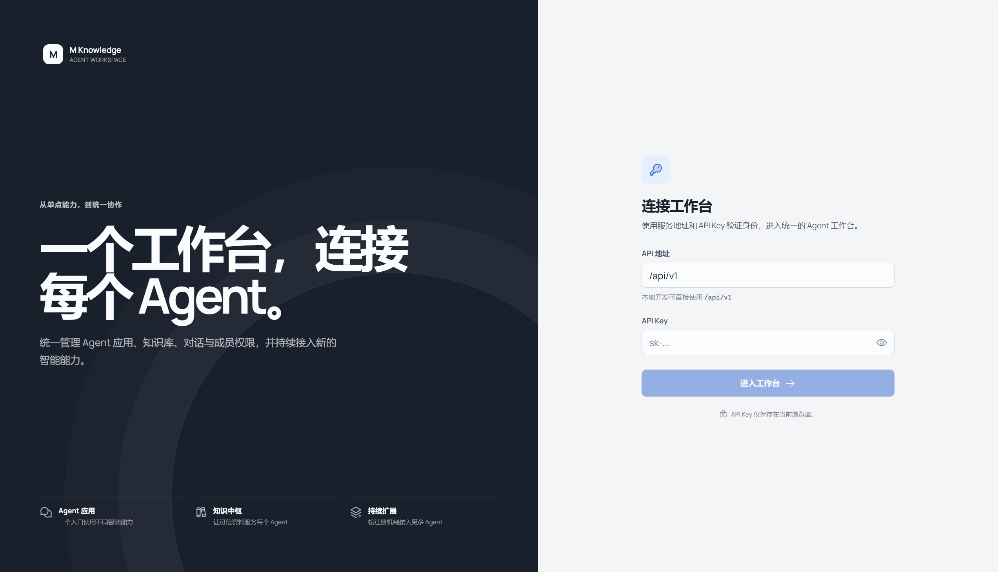
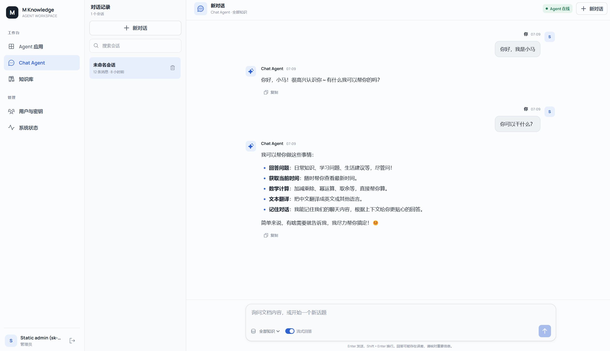
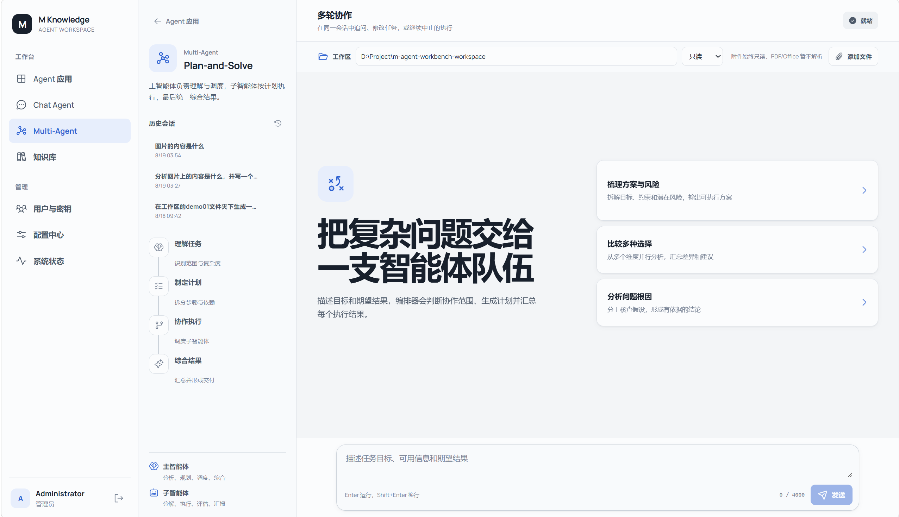
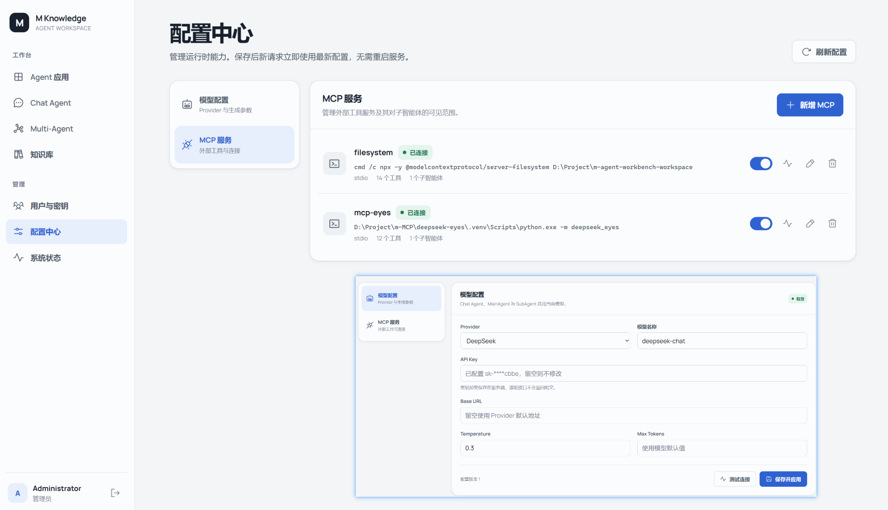

# m-agent-workbench

面向多 Agent 应用的统一工作台。

`m-agent-workbench` 基于 FastAPI 与 Vue 3 构建，为 Agent 应用提供统一入口，并集中管理身份认证、成员权限、会话、知识库和运行状态。当前内置 Chat Agent、多智能体（Plan-and-Solve 编排）与 RAG 知识库，后续 Agent 可以复用同一套工作台基础能力持续接入。

## 核心能力

- **Agent 应用中心**：从统一入口访问不同 Agent，当前提供 Chat Agent 与多智能体（Plan-and-Solve 编排）。
- **流式智能对话**：支持 SSE 流式回答、多轮会话和会话历史。
- **多智能体编排**：MainAgent 负责任务分析、计划制定与调度，多个 SubAgent 分工执行并综合结果。
- **会话工作区与只读附件**：Multi-Agent 会话绑定一个本地工作区（只读/读写），可上传对话附件；执行受文件作用域沙箱约束，MCP 工具据此做路径权限门控。
- **多轮协作与断点续跑**：同一会话内可追问、修改任务，或「继续」中止的编排执行，历史对话经摘要压缩进入上下文。
- **运行时配置中心**：在 WebUI 中动态切换 LLM 模型与外部 MCP 服务，保存后新请求立即生效，无需重启（密钥加密落库）。
- **MCP 外部工具集成**：连接 stdio / streamable-http 外部 MCP Server，自动发现工具并按 `subagents` 字段注入指定子智能体。
- **RAG 知识库**：支持文档解析、向量索引，以及私有、共享、混合范围检索。
- **成员与密钥管理**：使用数据库持久化用户和 API Key，并按管理员、成员角色控制权限。
- **可扩展工作台**：前端通过 Agent 注册表展示应用，后端提供 Agent 基类、工具注册与服务层，便于继续接入新 Agent。
- **运行状态监控**：统一查看 Agent、Embedding、Milvus 与检索服务状态。

## 界面预览











---

## 项目结构

```
m-agent-workbench/
├── src/
│   ├── agents/                    # Agent 层：BaseAgent / ChatAgent
│   │   └── multi_agent/           # 多智能体：MainAgent 编排 + 出厂 SubAgent(general_assistant / workspace_file_agent / vision_agent) + 注册中心
│   ├── tools/                     # Agent 工具基类与注册表
│   │   ├── backend_api/           # 后端 API 工具（遥感、Tavily 搜索）
│   │   ├── general/               # 通用工具
│   │   ├── mcp/                   # MCP 适配（配置 / 传输 / 连接 / 发现 / 转换 / 文件作用域权限）
│   │   ├── single_agent_planning/ # 单智能体规划工具
│   │   └── multi_agent_planning/  # 多智能体规划工具
│   ├── models/                    # LLM 适配
│   ├── config/                    # Agent 全局配置
│   ├── prompt/                    # 提示词模板（对话 / 规划 / 多智能体 / 遥感）
│   ├── callbacks/                 # 回调（Token 计数等）
│   ├── utils/                     # 日志、重试等工具函数
│   ├── rag/                       # RAG 知识库层（解析、分块、Embedding、Milvus、存储、任务、检索）
│   │   ├── documents/             # 文档服务与异常
│   │   ├── parsing/               # Text / Markdown / PDF / MinerU 解析
│   │   ├── chunking/              # 文档分块策略
│   │   ├── embedding/             # Embedding 服务适配
│   │   ├── milvus/                # Milvus 向量数据库
│   │   ├── storage/               # OSS / Local 文件存储
│   │   ├── tasks/                 # 文档索引任务管线
│   │   └── retrieval/             # 检索服务（基础 + 高级检索）
│   └── server/                    # FastAPI 工作台后端
│       ├── main.py                # 应用初始化与生命周期
│       ├── api/                   # 认证、用户、会话、Chat、Multi-Agent、运行时配置 API
│       ├── repositories/          # SQLite / Memory 存储实现（含运行时配置、消息、轮次、摘要）
│       ├── services/              # 认证、会话、对话、多智能体编排、工作区/附件、运行时配置、密钥加密
│       ├── middleware/            # 中间件
│       ├── bootstrap_admin.py     # 初始化首位管理员
│       └── exceptions.py          # 统一异常
│
├── front/                         # Vue 3 前端
│   ├── src/constants/agents.ts    # Agent 应用注册表
│   ├── src/views/                 # 应用中心、对话、知识库、管理、系统与配置中心页面
│   ├── src/components/            # 布局、对话与反馈组件
│   ├── src/stores/app.ts          # Pinia 全局状态
│   ├── src/api/client.ts          # 后端 API 客户端
│   └── src/styles/main.css        # 工作台视觉样式
│
├── webui/index.html               # 单文件测试控制台 (纯 HTML/JS)
├── .env.example                   # 环境变量模板
├── mcp.json.example               # MCP 服务配置模板（启动种子，运行期以 WebUI 为准）
├── requirements.txt               # Python 依赖
├── Dockerfile.backend             # FastAPI 后端镜像
├── Dockerfile.nginx               # 多阶段构建: Vue 编译 → Nginx
├── nginx.conf                     # Nginx 反向代理配置
├── docker-compose.yml             # Docker Compose 编排
├── .dockerignore                  # Docker 构建忽略规则
└── DEPLOY.md                      # 部署详细指南
```

---

## 快速开始

### 1. 安装依赖

```bash
pip install -r requirements.txt
```

### 2. 配置环境变量

```bash
cp .env.example .env
```

最少配置:
```bash
# LLM (至少一个)
DEEPSEEK_API_KEY=sk-your-key

# Embedding (可选, 无则不建索引)
BAILIAN_API_KEY=sk-your-key

# Milvus (可选, 无则不建索引)
MILVUS_HOST=localhost
```

> LLM 模型与 MCP 服务启动后可在 WebUI「配置中心」动态修改，无需重启；`.env` / `mcp.json` 仅作首次启动的种子。

### 3. 初始化首位管理员（仅全新数据库）

API Key 不再从 `.env` 加载，而是创建后仅以哈希形式持久化。已有数据库可跳过此步：

```bash
python -m src.server.bootstrap_admin --name Administrator
```

命令只会显示一次完整 API Key，请立即妥善保存。

### 4. 启动后端

```bash
uvicorn src.server.main:app --reload --port 8000
```

### 5. 启动前端

```bash
cd front
npm install
npm run dev        # http://localhost:5173
```

或使用测试控制台:
```bash
# 浏览器打开 webui/index.html
```

---

## Docker Compose 部署（生产环境）

适用于将项目部署到远程服务器，Milvus 已独立部署的场景。

### 架构

```
Port 9090 (宿主机)
       │
  ┌────▼─────────┐
  │   Nginx      │  ← 前端静态文件 + API 反向代理
  └────┬─────────┘
       │ /api, /health → http://backend:8000
  ┌────▼─────────┐
  │   Backend    │  ← FastAPI + Uvicorn
  └────┬─────────┘
       │
       ├── SQLite (Docker volume)
       ├── 文件存储 (Docker volume)
       └── Milvus (外部独立部署)
```

### 部署步骤

```bash
# 1. Clone 项目
git clone <repo-url> /opt/agent-workbench
cd /opt/agent-workbench

# 2. 配置环境变量
cp .env.example .env
vim .env   # 填入 LLM Key、BAILIAN_API_KEY、MILVUS_HOST 等

# 3. 构建并启动
sudo docker compose up -d --build

# 4. 初始化管理员 (API Key 只显示一次!)
sudo docker compose exec backend python -m src.server.bootstrap_admin --name Administrator

# 5. 浏览器访问
# http://<服务器IP>:9090
```

### 环境变量要点

| 变量 | 说明 |
|------|------|
| `DEEPSEEK_API_KEY` | LLM API Key（至少配置一个） |
| `BAILIAN_API_KEY` | 阿里云百炼 Embedding |
| `MILVUS_HOST` | Milvus 地址（**不能用 localhost**，容器内无法访问宿主机 localhost） |
| `MILVUS_PORT` | Milvus 端口（默认 19530） |

> **注意**: Milvus 在宿主机时，`MILVUS_HOST` 请填写宿主机实际 IP（如 `192.168.x.x`），容器内的 `localhost` 指向容器自身而非宿主机。

### 常用运维命令

```bash
sudo docker compose logs -f backend   # 查看后端日志
sudo docker compose restart           # 重启所有服务
sudo docker compose down              # 停止并删除容器（数据保留）
sudo docker compose up -d --build     # 更新后重新构建
```

> 详细部署文档见 [DEPLOY.md](DEPLOY.md)

---

## 工作台 API

### 认证 & 用户

| 方法 | 端点 | 权限 | 说明 |
|------|------|------|------|
| `GET` | `/api/v1/me` | 用户 | 当前用户信息 |
| `GET` | `/api/v1/users` | admin | 用户列表 |
| `POST` | `/api/v1/users` | admin | 创建用户 |
| `GET` | `/api/v1/users/{id}` | admin | 用户详情 |
| `DELETE` | `/api/v1/users/{id}` | admin | 删除用户 |
| `GET` | `/api/v1/users/{id}/api-keys` | admin | 用户所有 Key |
| `POST` | `/api/v1/api-keys` | admin | 生成 Key |
| `DELETE` | `/api/v1/api-keys/{prefix}` | admin | 撤销 Key |

### 会话

| 方法 | 端点 | 说明 |
|------|------|------|
| `GET` | `/api/v1/sessions?session_type=chat\|multi_agent` | 按智能体类型列出会话 |
| `POST` | `/api/v1/sessions` | 创建会话 |
| `GET` | `/api/v1/sessions/{id}/messages` | 消息历史 |
| `PATCH` | `/api/v1/sessions/{id}` | 重命名会话 |
| `DELETE` | `/api/v1/sessions/{id}` | 删除会话（含对应 Agent 持久化状态） |

### Chat Agent

| 方法 | 端点 | 说明 |
|------|------|------|
| `POST` | `/api/v1/chat` | 同步问答 |
| `POST` | `/api/v1/chat/stream` | SSE 流式问答 |

请求体: `{ "query", "session_id", "knowledge_scope": "hybrid|private|shared" }`

### Multi-Agent

| 方法 | 端点 | 说明 |
|------|------|------|
| `POST` | `/api/v1/multi-agent/chat/stream` | SSE 流式多智能体问答 |
| `POST` | `/api/v1/multi-agent/chat/{session_id}/cancel` | 取消运行中的编排 |

请求体: `{ "query", "session_id", "attachment_ids" }`
（`session_id` **必填**，须为已配置工作区的会话，否则返回 `WORKSPACE_REQUIRED`(409)；
`attachment_ids` 可选，列出本轮引用的会话附件 ID）。

> Multi-Agent 会话引入**工作区与只读附件**机制：执行被绑定到会话文件作用域（`ExecutionFileScope`），
> 工作区文件助手与 MCP 工具仅能读写被授权的路径，附件始终只读。详细全链路见
> [docs/multi-agent-request-flow-v2.md](docs/multi-agent-request-flow-v2.md)。

事件类型: `start` / `turn_started` / `status` / `analyzing` / `analysis_done` / `plan_created` /
`dispatching` / `subagent_start` / `subagent_plan` / `subagent_step` / `subagent_progress` /
`subagent_done` / `synthesizing` / `synthesis_done` / `tool_call` / `tool_result` / `token` /
`error` / `cancelled` / `done`

### 运行时配置（admin）

| 方法 | 端点 | 说明 |
|------|------|------|
| `GET` | `/api/v1/admin/config/llm` | 当前模型配置（密钥脱敏） |
| `PUT` | `/api/v1/admin/config/llm` | 保存并应用模型配置（热切换） |
| `POST` | `/api/v1/admin/config/llm/test` | 测试模型连接 |
| `GET` | `/api/v1/admin/config/mcp` | MCP 服务列表 |
| `POST` | `/api/v1/admin/config/mcp` | 新增 MCP 服务 |
| `PUT` | `/api/v1/admin/config/mcp/{id}` | 更新 MCP 服务 |
| `PATCH` | `/api/v1/admin/config/mcp/{id}/enabled` | 启停 MCP 服务 |
| `POST` | `/api/v1/admin/config/mcp/{id}/test` | 测试 MCP 连接 |
| `DELETE` | `/api/v1/admin/config/mcp/{id}` | 删除 MCP 服务 |

以上端点均需管理员权限；保存后新请求立即使用最新配置，无需重启。

### 文档

| 方法 | 端点 | 说明 |
|------|------|------|
| `POST` | `/api/v1/documents` | 上传文档 (multipart) |
| `POST` | `/api/v1/documents/batch` | 批量上传文档，逐文件返回处理结果 |
| `GET` | `/api/v1/documents` | 分页文档列表，支持搜索、范围和状态筛选 |
| `GET` | `/api/v1/documents/{id}` | 文档详情 |
| `GET` | `/api/v1/documents/{id}/download` | 下载原始文件 |
| `DELETE` | `/api/v1/documents/{id}` | 删除文档 |
| `GET` | `/api/v1/tasks/{id}` | 索引任务进度 |
| `GET` | `/api/v1/tasks?task_ids=...` | 批量查询索引任务进度 |

文档列表参数：`page`（默认 1）、`page_size`（默认 20，最大 100）、`search`、
`scope=private|shared`、`status=indexed|processing|failed`。响应包含
`items`、`total`、`page`、`page_size` 和 `total_pages`。

### 健康检查

| 端点 | 说明 |
|------|------|
| `/health/live` | 存活检查 |
| `/health/ready` | 就绪检查 (含依赖状态) |

---

## 工作台架构

### Agent 扩展方式

当前版本内置 Chat Agent 与多智能体（Plan-and-Solve 编排），并将 Agent 实现与工作台通用能力分层：

1. 在 `src/agents/` 中基于 `BaseAgent` 实现 Agent 能力；多智能体场景通过 `SubAgentRegistry` 注册新的 SubAgent 类型并按需挂载工具。
2. 在 FastAPI 服务层接入 Agent，复用认证、会话、知识检索和状态检查能力。
3. 在 `front/src/constants/agents.ts` 注册应用信息与路由，使新 Agent 出现在应用中心。

前端注册表负责应用入口展示；新 Agent 的后端接口与业务逻辑仍需显式实现，避免工作台展示尚不可用的能力。

### 运行时配置与 MCP

LLM 模型与 MCP 服务为运行时可配置项，由 `RuntimeConfigService` 统一管理：

- 配置持久化到数据库并以 Fernet 加密（`CONFIG_ENCRYPTION_KEY`），读取接口脱敏。
- 首次启动从 `.env` / `mcp.json` 种子；之后以 WebUI「配置中心」为准。
- 修改保存后热更新：重建 Agent 与工具 Registry，新请求立即生效，旧实例退役后异步关闭。
- MCP 支持 stdio（本地子进程）与 streamable-http（远程），工具按 `subagents` 字段注入子智能体。

完整链路见 [docs/multi-agent-request-flow-v2.md](docs/multi-agent-request-flow-v2.md)（全链路）与 [docs/mcp-tool-discovery-flow.md](docs/mcp-tool-discovery-flow.md)。

### 用户数据隔离

四层隔离确保多用户数据安全:

| 层级 | 方式 | 说明 |
|------|------|------|
| Document SQLite | `user_id` 列 | 权威用户归属 |
| Chunk SQLite | `user_id` 列 | 审计追踪 |
| Milvus | Partition Key | `user_id` 物理分区, shared 文档入 `""` 公共分区 |
| API | 每个端点校验 | 跨用户访问返回 404 |

### 文档索引管线

```
Upload → Storage (OSS/Local)
     → Bounded TaskQueue
     → TaskWorker
         → Parser (Text/Markdown/PDF/MinerU)
         → Chunker
         → Bailian Embedding (text-embedding-v4 / qwen3.7-text-embedding)
         → Milvus Insert (with Partition Key)
         → SQLite Transaction (ChunkRecord + Document + Task)
```

文档摄取采用补偿式事务：解析和向量化不会占用长时间数据库事务；Milvus 写入后，
Chunk、文档状态和任务状态由 `aiosqlite` 在固定连接上一次提交。任一步失败会清理
已写入的向量、Chunk 和暂存原文件，服务重启时会恢复未完成任务。

### 存储后端

| 配置 | 选项 | 默认 |
|------|------|------|
| `REPOSITORY_BACKEND` | `sqlite` / `memory` | `sqlite` |
| `STORAGE_SQLITE_DIR` | 路径 | `./data` |
| `DOCUMENT_TASK_CONCURRENCY` | 正整数 | `2` |
| `LOG_LEVEL` | `DEBUG` / `INFO` / `WARNING` / `ERROR` | `INFO` |
| `STORAGE_BACKEND` | `local` / `oss` | `local` |
| `STORAGE_LOCAL_DIR` | 路径 | `./storage/files` |

---

## 配置选项

完整配置见 [.env.example](.env.example):

| 分类 | 环境变量 | 说明 |
|------|----------|------|
| LLM | `LLM_PROVIDER` / `LLM_MODEL` / `LLM_BASE_URL` | 模型选择（启动种子，运行期以 WebUI 为准） |
| LLM | `OPENAI_API_KEY` / `DEEPSEEK_API_KEY` / `ANTHROPIC_API_KEY` | 模型 Provider |
| 运行时配置 | `CONFIG_ENCRYPTION_KEY` | WebUI 配置加密主密钥 |
| 认证 | — | 用户与 API Key 由工作台管理并持久化到数据库 |
| Embedding | `BAILIAN_API_KEY` / `BAILIAN_WORKSPACE_ID` / `EMBEDDING_MODEL` | 阿里云百炼 |
| Milvus | `MILVUS_HOST` / `MILVUS_PORT` / `MILVUS_VECTOR_DIM` | 向量数据库 |
| 解析 | `MINERU_API_KEY` / `MINERU_API_URL` / `MINERU_MODEL_VERSION` | PDF OCR |
| 搜索工具 | `TAVILY_API_KEY` | Tavily 网络搜索工具 |
| MCP | `MCP_CONFIG_PATH` | MCP 配置文件路径（启动种子） |
| 多轮上下文 | `MULTI_AGENT_CONTEXT_MAX_TOKENS` / `MULTI_AGENT_MAX_HISTORY_TURNS` | Multi-Agent 上下文预算 |
| Multi-Agent 工作区 | `MULTI_AGENT_WORKSPACE_ROOTS` / `MULTI_AGENT_ATTACHMENT_DIR` / `MULTI_AGENT_ATTACHMENT_MAX_MB` | 允许的工作区白名单、附件存储目录与单附件上限 |
| 存储 | `STORAGE_BACKEND` / `OSS_*` | 文件存储 |
| 检索 | `REWRITE_MODEL` | 启用 Query 改写 |

---

## 前端工作台

两种前端可用:

### Vue 3 SPA (`front/`)

基于 Vite、Vue 3、Pinia 与 Vue Router 构建，提供：

- Agent 应用中心与统一导航
- Chat Agent 流式对话与 Markdown 渲染
- 多智能体编排：执行追踪时间线（含子智能体/工具调用事件透传）、最终交付面板、多轮协作与断点续跑
- Multi-Agent 工作区：会话工作区选择（只读/读写）、附件上传与引用
- RAG 知识库文档上传、下载、删除与索引状态跟踪
- 管理员用户与 API Key 管理
- 配置中心：动态切换 LLM 模型与 MCP 服务
- 工作台依赖与运行状态监控

```bash
cd front && npm install && npm run dev
```

### 测试控制台 (`webui/index.html`)

单文件 HTML 调试界面，除 marked.js CDN 外无额外依赖，可直接在浏览器中连接后端进行基础功能验证。正式使用建议选择 Vue 3 工作台。

---

## License

MIT
