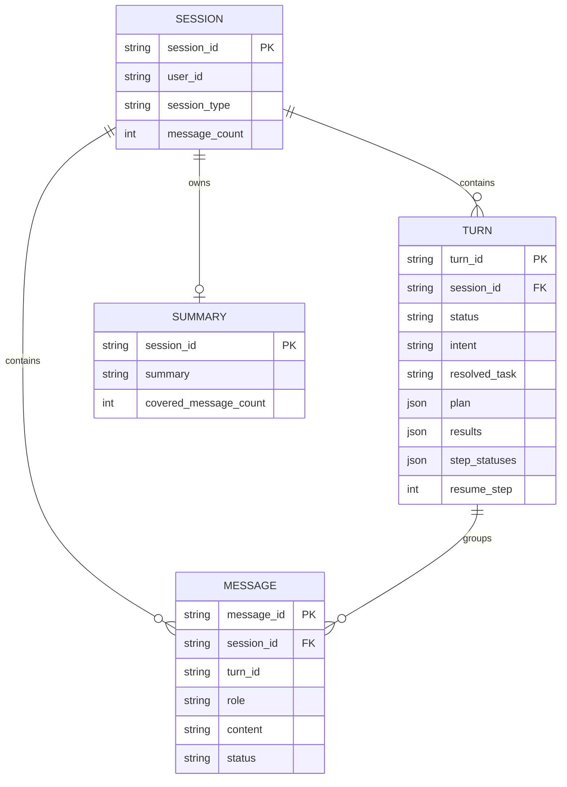
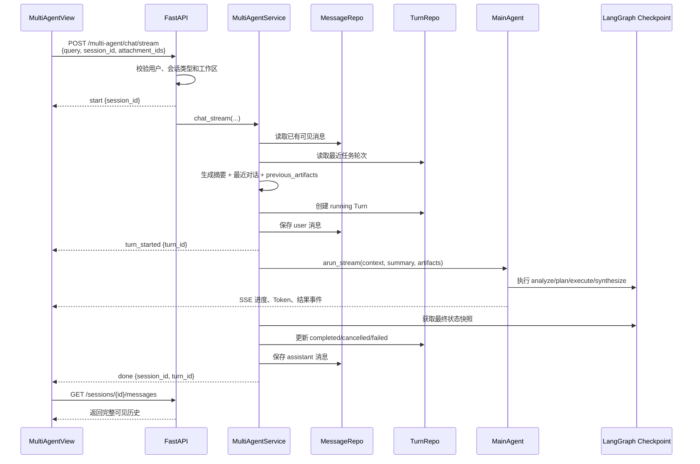
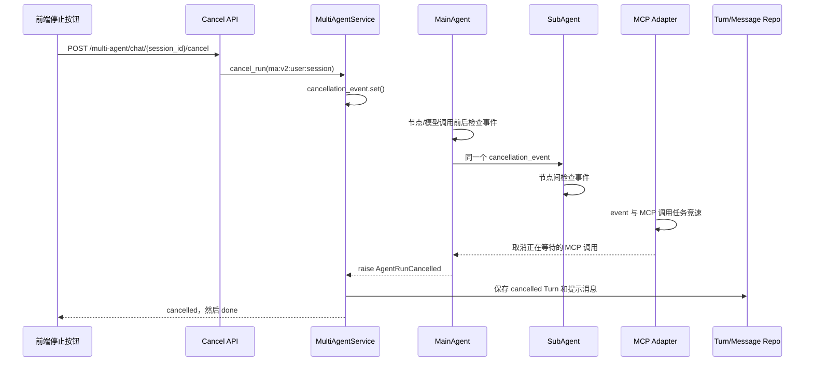

# Multi-Agent 多轮会话与任务续跑实现详解

本文专门说明 Multi-Agent 如何从“一次请求执行一个任务”演进为支持多轮会话、追问、修改任务、中止后继续和长对话摘要的任务型智能体。

文档基于当前实际代码，重点回答以下问题：

- 同一个会话中的多次请求如何关联；
- “对话消息”和“编排内部状态”为什么必须分开保存；
- 模型如何判断当前输入是新任务、追问、修改任务还是继续任务；
- “继续”如何复用上一轮已经完成的步骤，而不是重新规划并从头执行；
- 用户点击中止后，信号如何到达 MainAgent、SubAgent 和 MCP 工具；
- 历史消息过长时如何生成摘要并控制 Token 窗口；
- 前端如何复用 `session_id`、展示历史消息并避免重复显示当前轮。

完整的 API、工作区、附件、MCP 和 SSE 链路可继续参考 [multi-agent-request-flow-v2.md](multi-agent-request-flow-v2.md)。

---

## 1. 核心概念

Multi-Agent 多轮能力由四个不同层次的数据共同组成。

| 概念 | 标识 | 生命周期 | 保存内容 | 是否展示给用户 |
|---|---|---|---|---|
| 会话 Session | `session_id` | 从创建到删除 | 所有权、类型、标题、消息数、工作区 | 是 |
| 任务轮次 Turn | `turn_id` | 一次用户输入及其完整执行 | 意图、完整任务、计划、步骤结果、进度、最终状态 | 只展示执行结果，不直接展示内部字段 |
| 对话消息 Message | `message_id` | 会话内长期保存 | 用户原始输入、助手最终回答、中止或失败提示 | 是 |
| LangGraph checkpoint | `thread_id` | 同一会话的内部编排状态 | 当前节点、计划索引、步骤状态等 | 否 |

关系如下：



最重要的边界是：

> `SessionMessage` 只保存用户真正看到的对话；`MainAgentState` 和 checkpoint 只保存编排过程。分析文本、执行计划、工具调用和步骤状态不能混入对话消息。

这样可以避免两个问题：

1. 历史消息接口把内部分析或工具过程错误地展示到前端；
2. 下一轮 Prompt 把旧的内部消息当成用户对话，导致模型自我引用、重复规划或无限循环。

对应实现：

- 数据模型：[repositories/base.py](../src/server/repositories/base.py)
- SQLite 表结构：[repositories/sqlite.py](../src/server/repositories/sqlite.py)
- MainAgent 状态：[states.py](../src/agents/multi_agent/states.py)

---

## 2. 持久化模型

### 2.1 `session_messages`：用户可见消息

`SessionMessage` 保存一条用户可见消息：

```text
message_id
session_id
turn_id
role            user | assistant
content
status          pending | complete | failed | cancelled
metadata        JSON
created_at
```

正常完成的一轮会生成两条消息：

```text
user      status=complete   用户原始输入
assistant status=complete   最终回答
```

中止或失败的一轮也保留两条消息：

```text
user      status=complete
assistant status=cancelled  本轮任务已中止，可继续执行未完成步骤
```

或：

```text
assistant status=failed     本轮任务执行失败：...
```

消息的 `metadata` 当前还可以保存本轮附件、答案来源和置信度。

### 2.2 `multi_agent_turns`：任务轮次快照

`MultiAgentTurn` 是任务续跑的事实来源，保存：

| 字段 | 作用 |
|---|---|
| `status` | `running`、`completed`、`failed` 或 `cancelled` |
| `intent` | 当前输入相对历史的意图 |
| `resolved_task` | 消解“它”“继续”“上一份”等指代后的完整任务 |
| `plan` | MainAgent 生成或恢复的执行计划 |
| `results` | 已完成步骤的结果，键为 `step_id` |
| `step_statuses` | 每个步骤的 `success`、`failed` 等状态 |
| `sources` | 最终综合结果使用的来源 |
| `resume_step` | 中止或失败时的当前步骤索引 |
| `final_answer` | 仅正常完成时保存最终答案 |
| `error_message` | 失败原因 |

对话消息负责“用户看到什么”，任务轮次负责“系统已经做到哪里”。两者通过 `turn_id` 关联。

### 2.3 `conversation_summaries`：较早历史摘要

摘要表每个会话只有一条记录：

```text
session_id
summary
covered_message_count
updated_at
```

`covered_message_count` 表示前多少条消息已经被压缩进摘要。下一次生成摘要时，只处理上次覆盖位置之后、新近被移出直接上下文窗口的消息，避免反复总结同一批内容。

### 2.4 删除与级联清理

三个表都通过 `session_id` 外键关联 `sessions`，SQLite 使用 `ON DELETE CASCADE`。服务层删除 Multi-Agent 会话时还会主动清理：

- LangGraph checkpoint；
- 用户可见消息；
- 任务轮次；
- 历史摘要；
- 工作区和附件资源；
- 会话锁。

运行中的会话不能直接删除，服务会返回 `SESSION_BUSY`，避免 checkpoint 和任务快照写到一半被移除。

---

## 3. 会话标识、轮次标识和 checkpoint 隔离

### 3.1 `session_id`：前后端的多轮关联键

前端第一次提交任务时执行 `ensureSessionWorkspace()`：

1. 创建 `session_type=multi_agent` 的会话；
2. 为会话配置工作区；
3. 把返回的 `session_id` 保存到 `activeSessionId`；
4. 请求体显式携带该 ID。

后续追问不会再次创建会话，而是继续发送：

```json
{
  "query": "把第二点展开说明",
  "session_id": "同一个 session_id",
  "attachment_ids": []
}
```

只有用户点击“新建”、切换历史会话或删除当前会话时，`activeSessionId` 才会改变。

当前 API 要求 Multi-Agent 会话必须已经配置工作区。如果没有 `session_id`，返回 `WORKSPACE_REQUIRED`（HTTP 409），不在 API 层隐式创建会话。

### 3.2 `turn_id`：每次提交都有独立轮次

即使复用同一个 `session_id`，每次提交都会生成新的 UUID `turn_id`。

例如：

```text
session_id = S1

turn T1: “调研 A 和 B”
turn T2: “重点解释第二项差异”
turn T3: “改成表格”
turn T4: “继续”
```

服务创建 Turn 和用户消息后，先发送 SSE：

```text
event: turn_started
data: {"session_id":"S1", "turn_id":"T2"}
```

前端把它记录为 `activeTurnId`，并在历史消息区域暂时过滤当前轮消息，避免“实时执行卡片”和“历史消息气泡”重复显示同一内容。任务结束后，前端重新调用消息历史接口，以仓储中的最终结果校准页面。

### 3.3 `thread_id`：LangGraph 内部命名空间

同一 Multi-Agent 会话使用稳定 thread ID：

```text
ma:v2:{user_id}:{session_id}
```

例如：

```text
ma:v2:user-123:session-456
```

设计目的：

- `user_id` 防止不同用户的同名会话碰撞；
- `session_id` 让同一会话复用 checkpoint；
- `ma:v2:` 与 Chat Agent 以及旧 Multi-Agent checkpoint 隔离；
- 当前实现不迁移旧 checkpoint，旧内部消息不会进入新状态。

虽然同一会话复用 checkpoint，但每轮调用 `_new_turn_state()` 都会显式重置计划、结果、重试计数、答案等当前轮字段。需要复用的旧成果通过 `previous_artifacts` 明确传入，而不是依靠 checkpoint 中残留的旧值。

---

## 4. 一次多轮请求的完整生命周期



服务层对同一个 `thread_id` 使用 `asyncio.Lock`。因此同一会话中的两轮任务不会并发写入同一个 checkpoint；前端也会在 `running=true` 时禁用重复提交。

---

## 5. 对话消息与编排内部状态的拆分

### 5.1 用户可见对话

用户历史来自 `SessionMessageRepository`。消息接口先检查会话所有权和 `session_type`，再路由：

- Chat 会话 → `ChatService.get_session_messages()`；
- Multi-Agent 会话 → `MultiAgentService.get_session_messages()`。

Multi-Agent 不再从 LangGraph checkpoint 临时拼出“最后一问一答”，因此可以返回完整多轮历史，且不会泄露计划、工具调用或模型分析。

### 5.2 MainAgent 内部状态

`MainAgentState` 只保存当前轮的上下文快照和编排字段：

```text
当前轮输入:
  turn_id, current_input

外部上下文:
  conversation_context
  conversation_summary
  resource_context
  previous_artifacts

结构化分析:
  intent, resolved_task, referenced_turn_ids
  reuse_previous_artifacts, needs_subagents, task_summary

编排状态:
  plan, current_step_index
  subagent_results, subagent_statuses, step_retry_counts

综合结果:
  synthesized_answer, synthesis_sources, synthesis_confidence
```

MainAgentState 没有用于累加用户对话的 `messages` reducer。SubAgent 内部仍有自己的 ReAct `messages`，但它属于子任务执行过程，不会写入 `session_messages`。

---

## 6. 最近对话如何进入所有 MainAgent Prompt

### 6.1 分析节点

`analyze_node` 使用专门的任务分析模板，将以下信息一次性交给结构化模型：

- 当前用户原始输入；
- 最近用户/助手对话，保留 `turn_id`；
- 较早对话摘要；
- 最近三轮可复用任务产物；
- 当前可用 SubAgent 列表；
- 工作区和附件资源上下文。

分析节点的目标不是直接回答，而是生成 `TaskAnalysisOutput`。

### 6.2 其他 MainAgent 节点

`respond`、`plan`、MainAgent 直接执行步骤和 `synthesize` 都通过 `_build_context_messages()` 构造 Prompt：

```text
System: MainAgent 系统提示
System: 工作区/附件可信资源上下文（如果有）
System: 较早对话摘要（如果有）
Human/AI: 最近可见对话
System: 相关历史任务产物（reuse_previous_artifacts=true 时）
Human: 当前节点指令
```

这保证了所有主要决策节点都能理解“这个”“第二点”“按刚才格式”等指代，同时不会把旧的内部计划和工具消息伪装成对话历史。

### 6.3 历史任务产物

服务把最近三轮 `MultiAgentTurn` 转成 `previous_artifacts`：

```text
turn_id
status
intent
resolved_task
plan
results
step_statuses
sources
resume_step
final_answer
```

分析节点总能看到这些产物的格式化摘要；其他节点仅在 `reuse_previous_artifacts=true` 时注入，以避免无关新任务被旧结果干扰。

---

## 7. `intent + resolved_task` 结构化分析

`TaskAnalysisOutput` 将“对话关系”和“实际要执行的任务”分成两个字段。

### 7.1 五种意图

| intent | 含义 | 示例 | 典型处理 |
|---|---|---|---|
| `chat` | 普通交流或静态问答 | “你能做什么？” | 通常直接回答 |
| `new_task` | 与历史无关的新任务 | “再分析另一份日志” | 创建新计划或直接处理，不复用旧产物 |
| `follow_up` | 对上一答案追问、解释或展开 | “第二点为什么？” | 结合历史回答生成更详细解释 |
| `revise_task` | 修改上一任务的目标、约束或输出形式 | “只保留近三个月，并改成表格” | 形成修改后的完整任务，可复用旧结果 |
| `continue_task` | 恢复中止、失败或未完成任务 | “继续”“接着执行” | 尝试恢复旧计划的未完成步骤 |

`intent` 与 `needs_subagents` 是两个不同维度。例如追问可能只是直接解释，也可能要求继续调用工具核实；修改任务也可能从简单格式调整升级为重新执行多个步骤。

### 7.2 `resolved_task`

`resolved_task` 必须是脱离对话上下文后仍可独立理解的完整任务。

示例：

```text
上一轮任务：比较方案 A 与方案 B 的成本、风险和交付周期。
当前输入：把第二点展开，并改成表格。

intent = revise_task
resolved_task = 详细展开方案 A 与方案 B 的风险差异，
                并将成本、风险和交付周期整理为表格。
```

MainAgent 后续的规划、直接回答、步骤委派和最终综合都优先使用 `resolved_task`，而不是含有歧义的原始短句。

### 7.3 历史引用与产物复用

- `referenced_turn_ids`：记录当前任务明确引用了哪些历史轮次；
- `reuse_previous_artifacts`：表示后续节点是否需要注入旧计划、结果或中止进度。

普通新任务应尽量为 `false`，避免历史污染；追问、修改和继续通常需要为 `true`，但最终由结构化分析模型根据上下文决定。

---

## 8. 追问如何实现

追问没有单独 API，它仍然是同一会话中的一个新 Turn。

例如：

```text
T1 用户：比较 A 和 B。
T1 助手：给出比较结果。

T2 用户：第二点为什么风险更高？
```

T2 执行时：

1. 服务读取 T1 的用户消息和助手回答；
2. 最近对话带着 `turn_id=T1` 进入 `analyze_node`；
3. 模型输出 `intent=follow_up`；
4. `resolved_task` 把“第二点”改写为明确问题；
5. 如果不需要工具，路由到 `respond`；
6. `respond` 再次接收最近对话和摘要，生成答案；
7. T2 的问答作为新的两条消息持久化。

因此追问不会修改 T1，也不会覆盖旧回答。它是关联到同一 Session 的独立新轮次。

---

## 9. 修改上一任务如何实现

修改任务同样创建新 Turn，但意图为 `revise_task`。

典型输入：

```text
“不要比较价格，只看安全性。”
“把时间范围改成最近七天。”
“保留刚才的数据，但输出成 Markdown 表格。”
```

处理方式：

1. `analyze_node` 使用历史对话消解被修改的对象；
2. `resolved_task` 合并旧目标和新约束；
3. 如果旧结果仍然有效，设置 `reuse_previous_artifacts=true`；
4. 直接回答、重新规划或委派 SubAgent 时注入旧结果；
5. 新轮次保存自己的计划、结果和最终答案，旧轮次保持不变。

这是一种“基于旧成果派生新任务”的方式，而不是原地修改历史 Turn。保留旧轮次有利于审计、回退和理解任务演化。

---

## 10. 中止机制

### 10.1 中止链路



### 10.2 前端行为

`stopRun()` 优先调用后端取消端点。后端返回 `{cancelled: true}` 后，前端保持 SSE 连接，等待服务端完成规范化收尾并返回 `cancelled` 事件。

如果取消端点不可达或当前没有可取消任务，前端才调用本地 `AbortController.abort()`。API 检测 SSE 断连后同样设置后端取消事件。

### 10.3 MainAgent 和 SubAgent 检查点

MainAgent 在以下位置检查取消事件：

- 每个图节点开始前；
- 普通模型调用完成后；
- 每次结构化输出尝试前后；
- SubAgent 返回后。

SubAgent 也在计划、执行、工具、评估和报告等节点间检查同一个事件。

结构化输出虽然允许一次格式纠错重试，但如果用户已经中止，第二次结构化调用不会继续发出。

### 10.4 正在执行的外部调用

取消是协作式的：

- 普通 LLM HTTP 请求一般需要等待当前请求返回，然后在调用后的检查点停止；
- MCP Adapter 会让实际 MCP 调用任务与 `cancellation_event.wait()` 竞速，取消信号到达时主动取消调用任务；
- 后续图节点、步骤重试和结构化重试不会继续执行。

### 10.5 中止状态持久化

服务捕获 `AgentRunCancelled`、SSE 断连或协程取消后，会读取当前 checkpoint 快照并保存：

```text
Turn.status          = cancelled
Turn.plan            = 当前计划
Turn.results         = 已有步骤结果
Turn.step_statuses   = 已有步骤状态
Turn.resume_step     = current_step_index
assistant message    = “本轮任务已中止。你可以发送‘继续’恢复未完成步骤。”
message.status       = cancelled
```

当中止发生得非常早、checkpoint 仍指向上一轮时，服务会比较快照中的 `turn_id`。如果与当前 Turn 不一致，就忽略旧快照，避免把上一轮计划污染到新轮次。

---

## 11. 中止后继续

“继续”不是对旧协程执行 `resume()`，而是创建一个新 Turn，并有选择地恢复旧计划和成果。

### 11.1 恢复条件

`_resume_previous_plan()` 只有在以下条件同时成立时才返回恢复状态：

```text
intent == continue_task
reuse_previous_artifacts == true
历史产物状态为 cancelled 或 failed
历史产物包含非空 plan
plan 中至少有一个步骤不是 success
```

如果条件不满足，则不会盲目恢复旧状态，MainAgent 会按本轮分析结果直接回答或生成新计划。

### 11.2 恢复位置

恢复逻辑按计划顺序查找第一个状态不是 `success` 的步骤：

```text
旧计划:
  step 1 = success
  step 2 = success
  step 3 = running / pending / failed
  step 4 = pending

新轮从 step 3 开始
```

恢复状态包含：

- 原计划 `plan`；
- 已有步骤结果 `subagent_results`；
- 已有步骤状态 `subagent_statuses`；
- 新的 `current_step_index`；
- `resumed_from_turn_id`；
- 清空后的 `step_retry_counts`。

已成功步骤不会重复调用，依赖这些步骤的后续任务仍可读取原有结果。

### 11.3 为什么“继续”也要重新分析

重新经过 `analyze_node` 有三个好处：

1. 判断用户是否真的要求继续，而不是发起无关新任务；
2. 将“继续，但不要再联网”“继续，并改成中文”等补充约束合并进 `resolved_task`；
3. 如果历史计划不可恢复，允许模型生成合理的新计划或给出说明。

### 11.4 当前恢复范围

服务当前向 MainAgent 提供最近三轮任务产物，所以自动续跑目标应位于最近三轮之内。通常“继续”指向刚刚中止的一轮，符合这一约束。

---

## 12. 步骤失败、重试与续跑的关系

执行步骤失败时，`execute_node` 不会直接回到 `plan` 或 `replan`，而是在当前步骤上按配置重试：

```text
step failed
  ├─ 不可重试错误 → 跳过重试，进入下一步骤
  ├─ retry_count <= max_step_retries → current_step_index 保持不变
  └─ 重试耗尽 → 记录 failed，进入下一步骤
```

这与“中止后继续”是两个层次：

- 步骤重试发生在同一个 Turn 内；
- 用户中止后继续会创建新 Turn，并从旧 Turn 的首个未成功步骤恢复。

`AgentRunCancelled` 不会被当成普通步骤失败捕获，因此不会触发后台继续重试。

---

## 13. 历史摘要与 Token 窗口

### 13.1 配置

```env
MULTI_AGENT_CONTEXT_MAX_TOKENS=6000
MULTI_AGENT_MAX_HISTORY_TURNS=10
```

- `MAX_HISTORY_TURNS` 限制直接进入 Prompt 的最近完整轮次数；
- `MAX_TOKENS` 限制摘要和最近消息使用的近似 Token 预算。

### 13.2 按完整轮次选择

消息先按 `turn_id` 分组，再从最新轮向前选择。不会在正常情况下只选中某轮的助手回答而丢掉该轮用户问题。

当较早消息被移出直接上下文窗口时：

1. 读取现有 `ConversationSummary`；
2. 根据 `covered_message_count` 找到尚未摘要的旧消息；
3. 调用 `MainAgent.summarize_conversation()` 增量更新摘要；
4. 保存新的摘要和覆盖位置。

摘要 Prompt 要求保留：

- 用户目标和约束；
- 已确认事实；
- 关键结论；
- 未完成事项；
- 可复用任务结果。

寒暄和内部编排过程不应进入摘要。

### 13.3 预算分配

当存在摘要或消息需要裁剪时，当前实现大致分配：

```text
摘要预算 = max(128, 总预算 / 3)
最近消息预算 = 总预算 - 摘要预算
```

如果最新一轮自身仍然超过预算，`_fit_messages_to_budget()` 会按各消息估算长度比例分配空间，并在截断位置添加 `…`。

### 13.4 Token 估算

为了不绑定某个模型的 tokenizer，服务使用保守近似：

```text
CJK 字符：约 1 字符 / token
其他文本：约 4 字符 / token
每条消息：额外预留 8 token 的角色和结构开销
```

这不是精确计费值，而是用于稳定控制 Prompt 尺寸的跨模型窗口策略。

---

## 14. 前端多轮展示与历史加载

### 14.1 关键前端状态

```text
activeSessionId       当前会话，后续请求复用
activeTurnId          当前正在执行的轮次
conversationMessages  从消息接口读取的完整历史
currentTask           当前输入
events                当前轮 SSE 事件
running               是否正在执行
```

### 14.2 历史会话

历史列表只请求：

```text
GET /api/v1/sessions?session_type=multi_agent
```

点击会话后并行加载：

- 完整消息历史；
- 会话工作区；
- 会话附件。

之后继续发送消息时，沿用该会话的 `activeSessionId`。

### 14.3 当前轮与历史消息去重

实时执行期间，页面一边展示当前任务卡片和执行轨迹，一边已经可能从后端拿到当前轮消息。因此：

```text
historicalMessages = conversationMessages
  .filter(message.turn_id !== activeTurnId)
```

当前轮结束、下一轮开始或重新加载历史时，这些消息再正常出现在对话历史中。

### 14.4 最终一致性

SSE 用于实时体验，消息仓储是最终事实来源。无论正常完成、中止还是失败，前端都会在请求结束后重新加载：

```text
GET /api/v1/sessions/{session_id}/messages
```

这样即使某个 SSE 事件丢失或浏览器短暂断线，刷新历史后仍能恢复完整对话。

---

## 15. 正常完成、中止和失败的状态对照

| 场景 | Turn 状态 | 助手消息状态 | `final_answer` | 是否可作为续跑来源 |
|---|---|---|---|---|
| 正常完成 | `completed` | `complete` | 保存 | 通常作为追问/修改成果，不做断点恢复 |
| 用户中止 | `cancelled` | `cancelled` | 空 | 是 |
| 执行异常 | `failed` | `failed` | 空 | 是，前提是存在未完成计划 |
| 尚在执行 | `running` | 尚未生成最终消息 | 空 | 否 |

中止或失败时，Turn 中仍会保留已经完成的 `results` 和 `step_statuses`。这正是新轮能够跳过成功步骤的基础。

---

## 16. 关键安全与一致性设计

### 16.1 同一会话串行执行

`_session_locks[thread_id]` 防止同一会话并行修改 checkpoint。不同会话仍可并行执行。

### 16.2 中止后屏蔽旧快照

保存中止状态前校验 `snapshot.turn_id == current turn_id`，防止新轮在第一个节点完成前被中止时错误读取上一轮 checkpoint。

### 16.3 结构化输出重试尊重中止

任务分析、SubAgent 匹配和最终综合使用结构化输出。每次调用前后都检查取消信号，所以用户中止后不会因为 JSON/Pydantic 解析失败再发起纠错重试。

### 16.4 工作区作用域按轮绑定

每轮执行开始时设置 `ExecutionFileScope`，结束时在 `finally` 中回收。取消事件也被放入该作用域，使 MCP 文件工具既遵守路径权限，也能响应本轮中止。

### 16.5 会话类型隔离

会话索引继续共用 `sessions` 表，但 API 必须明确使用 `session_type=chat` 或 `multi_agent`。消息接口先检查类型，再路由到对应服务，避免 Multi-Agent 历史出现在 Chat Agent。

---

## 17. 关键文件索引

| 文件 | 职责 |
|---|---|
| [front/src/views/MultiAgentView.vue](../front/src/views/MultiAgentView.vue) | 会话复用、历史展示、SSE 消费、中止按钮、工作区和附件 |
| [src/server/api/multi_agent.py](../src/server/api/multi_agent.py) | Multi-Agent 流式请求和取消 API |
| [src/server/api/sessions.py](../src/server/api/sessions.py) | 按会话类型路由历史消息、删除会话 |
| [src/server/services/multi_agent_service.py](../src/server/services/multi_agent_service.py) | Turn 生命周期、消息落库、上下文窗口、取消收尾 |
| [src/server/repositories/base.py](../src/server/repositories/base.py) | Message、Turn、Summary 数据模型和仓储协议 |
| [src/server/repositories/memory.py](../src/server/repositories/memory.py) | 内存仓储实现 |
| [src/server/repositories/sqlite.py](../src/server/repositories/sqlite.py) | SQLite 表和持久化实现 |
| [src/agents/multi_agent/states.py](../src/agents/multi_agent/states.py) | MainAgent/SubAgent 内部图状态 |
| [src/agents/multi_agent/main_agent.py](../src/agents/multi_agent/main_agent.py) | 意图分析、上下文注入、计划恢复、取消检查、摘要生成 |
| [src/agents/multi_agent/sub_agent.py](../src/agents/multi_agent/sub_agent.py) | 子任务执行及取消传播 |
| [src/tools/multi_agent_planning/task_analyzer.py](../src/tools/multi_agent_planning/task_analyzer.py) | `intent + resolved_task` 结构化 Schema |
| [src/prompt/planning.py](../src/prompt/planning.py) | 多轮任务分析 Prompt |
| [src/tools/mcp/adapter.py](../src/tools/mcp/adapter.py) | MCP 调用与取消事件竞速 |

---

## 18. 测试覆盖

主要回归测试位于 [tests/test_multi_agent_conversation.py](../tests/test_multi_agent_conversation.py)，覆盖：

- SQLite 消息、Turn、摘要仓储往返和级联删除；
- 同一 `session_id` 的第二轮能收到第一轮对话；
- `ma:v2:` thread ID；
- 中止 Turn 的计划、步骤状态和结果持久化；
- 下一轮能够收到中止产物；
- 从第一个未成功步骤恢复；
- 对话消息与内部状态分离；
- 中止阻止结构化输出重试；
- `intent` 和 `resolved_task` 进入最终状态；
- 历史摘要增量更新；
- 超大最新轮次遵守 Token 预算；
- 中止时不会把上一轮 checkpoint 复制到当前 Turn。

相关测试还包括：

- [tests/test_multi_agent_sqlite.py](../tests/test_multi_agent_sqlite.py)：checkpoint、SQLite、步骤重试和会话删除；
- [tests/test_multi_agent_workspace.py](../tests/test_multi_agent_workspace.py)：工作区权限与 MCP 调用中止；
- [tests/test_server.py](../tests/test_server.py)：会话类型过滤、消息路由和 API 行为。

建议执行：

```powershell
D:\DL\anaconda3\envs\agent\python.exe -m pytest `
  tests/test_multi_agent_conversation.py `
  tests/test_multi_agent_sqlite.py `
  tests/test_multi_agent_workspace.py -q
```

前端验证：

```powershell
Set-Location front
npm.cmd run typecheck
npm.cmd run build
```

---

## 19. 示例：一段完整的任务演进

```text
T1 new_task
用户：调研苹果折叠屏手机的发布时间和主要传闻。
系统：规划检索、交叉验证和综合步骤，执行完成。

T2 follow_up
用户：哪些信息来自供应链，可信度如何？
系统：结合 T1 回答和来源，解释供应链证据。

T3 revise_task
用户：只保留最近三个月的消息，并按时间排序。
系统：把旧目标与新约束合并为完整 resolved_task，复用可用结果并补充检索。

T4 被中止
用户：继续核对各家媒体的原始报道。
系统：步骤 1 完成，步骤 2 执行中；用户点击停止。
Turn.status=cancelled，保存步骤 1 结果和当前索引。

T5 continue_task
用户：继续。
系统：识别 continue_task，恢复 T4 计划，跳过成功的步骤 1，从步骤 2 开始。
```

这一流程体现了当前设计的核心原则：

> 每次输入都是可审计的新轮次；历史对话帮助理解意图，历史任务产物帮助复用成果，checkpoint 只负责执行状态，任何恢复都必须通过明确的结构化意图和状态校验。
